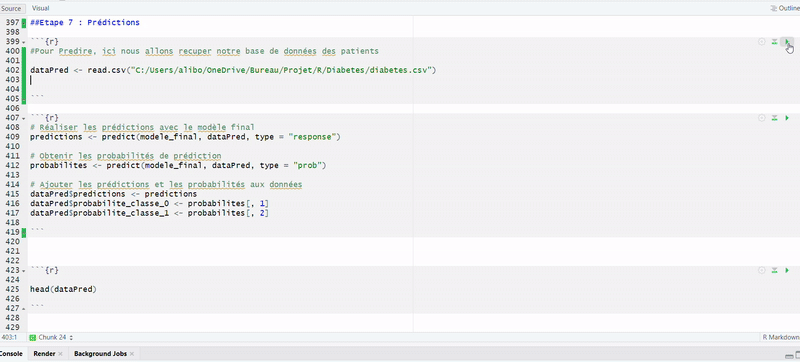

# Prédiction du diabète de type 2 (Machine Learning)

## Table des matières 

- [Contexte](#Contexte)
- [Objectifs](#Objectifs)
- [Description](#description)
- [Structure du projet](#structure)
- [Résultat & Démo](#Résultat&Démo)
- [Pré-requis](#pré-requis)

## Contexte 

Le diabète de type 2 est une maladie chronique en progression constante qui affecte de manière significative la qualité de vie et la santé globale. La détection précoce est cruciale pour mettre en place des interventions préventives et des traitements adaptés. Les populations amérindiennes Pima sont particulièrement à risque, présentant l’un des taux les plus élevés de diabète de type 2 dans le monde.
Utiliser les données spécifiques à cette population peut aider à développer des modèles de prédiction plus fiables et adaptés.

## Objectifs

L'objectif est de développer un modèle de machine learning capable de prédire efficacement l’occurrence du diabète de type 2 chez les femmes amérindiennes Pima à partir de variables biométriques et démographiques et aussi d'identifier les facteurs de risque les plus significatifs pour le diabète de type 2 dans cette population.

## Description

La base de données "Diabetes" est disponible sur Kaggle. Cette base de données contient des informations sur des patientes féminines âgées d'au moins 21 ans et provenant de populations amérindiennes Pima, qui ont été examinées pour déterminer s'ils avaient un diabète de type 2. Les caractéristiques incluent des mesures telles que la taille, le poids, l'âge, le nombre de grossesses, la pression artérielle.

La base de données contient les colonnes suivantes :

- `Pregnancies` : nombre de grossesses
- `Glucose` : concentration de glucose dans le plasma sanguin à jeun
- `BloodPressure` : pression artérielle diastolique (mm Hg)
- `SkinThickness` : épaisseur du pli cutané tricipital (mm)
- `Insulin` : taux d’insuline sérique à 2 heures (mu U/ml)
- `BMI` : indice de masse corporelle (kg/m^2)
- `DiabetesPedigreeFunction` : fonction pedigree du diabète
- `Age` : âge (années)
- `Outcome` : variable cible (0 = non diabétique, 1 = diabétique)

## Strcuture du projet 

1. **Collecte, Nettoyage et Préparation des données**  
   - Collecte des données brutes.  
   - Traitement des valeurs manquantes et nettoyage des données.  
   - Mise en forme et normalisation des variables.

2. **Feature Engineering**  
   - Division de la base en ensembles d'entraînement et de test pour garantir la généralisation du modèle.

3. **Entraînement des Modèles de Machine Learning**  
   - **Arbre de Décision (Decision Trees)** 
   - **Random Forest** 

4. **Optimisation des Modèles**  
   - Application du Cross Validation  pour une meilleure estimation des performances.  
   - Pruning et ajustement des hyperparamètres pour limiter l'overfitting.

5. **Prédictions et Visualisations**  
   - Génération de prédictions sur l'ensemble de test.  
   - Visualisation des résultats, notamment GIF via  pour démontrer le processus ou les performances.

## Résultat & Démo 

## Pré-requis

Avant de commencer, assurez-vous d’avoir les éléments suivants installés et configurés sur votre machine :

1. **R et RStudio** :  
   - Téléchargez et installez [R](https://cran.r-project.org/).  
   - Installez également [RStudio](https://posit.co/download/rstudio/) pour un environnement de développement intégré convivial.
  
2. **Cloner le code du markdown disponible [Script_Diabetes](Script_Diabetes) **  

3. **Packages R nécessaires**

Pour mener à bien cette étude de prédiction du diabète de type 2, assurez-vous d’avoir installé les packages R suivants :

- **`rpart`** : pour construire et visualiser les arbres de décision.
- **`randomForest`** : pour créer et optimiser des modèles de forêts aléatoires.
- **`caret`** : pour le tuning des hyperparamètres et la validation croisée.
- **`ggplot2`** : pour la visualisation avancée des résultats et des performances.
- **`readr`** : pour importer et manipuler aisément les données (fichiers CSV, etc.).
- **`dplyr`** : pour la manipulation et la transformation efficace des données.

